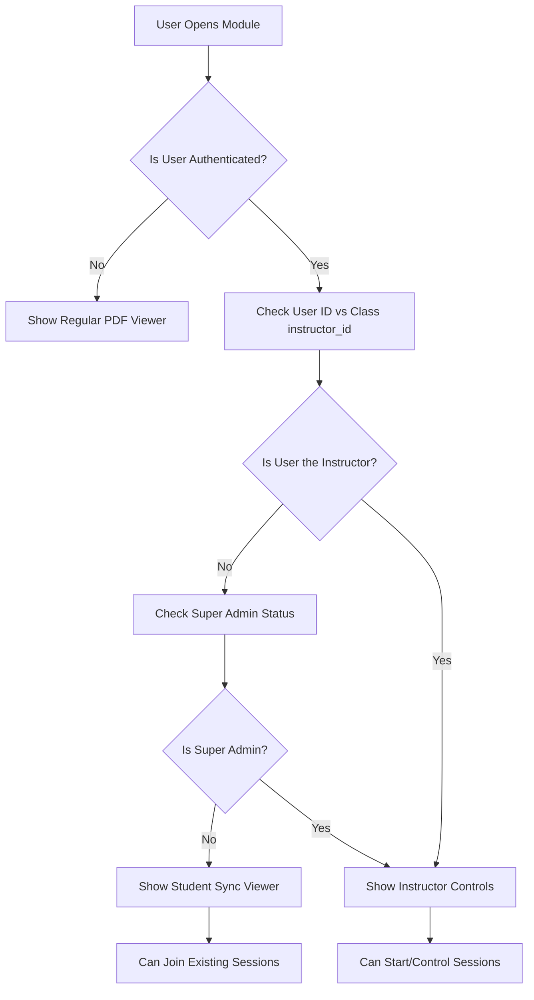

# 🎯 Synchronized Presentation Feature - Student View Control

## 📋 Problem Statement

During GAMMA presentation workshops, instructors display PDF presentations on a projector while students follow along on their own devices. Current issues include:

- **Students get lost** when not paying attention
- **Different viewing speeds** cause classroom disconnect  
- **No centralized control** over student viewing experience
- **Difficult to ensure synchronization** across all participants

## 🎯 Solution: Real-Time Presentation Sync

Implement a "follow the leader" feature where instructors can control what slide all students see in real-time, ensuring everyone stays synchronized during presentations.

## 👨‍🏫 **Instructor Identification & Authorization**

### **How Instructors Are Identified**

Your current system already has a robust instructor identification mechanism in place:

#### **1. Database Schema (Already Exists)**
```sql
-- classes table already has instructor_id field
classes {
  id: uuid,
  title: string,
  instructor_id: uuid REFERENCES auth.users(id),  -- This identifies the instructor
  ...
}

-- modules are linked to classes, so instructor ownership flows down
modules {
  id: uuid,
  class_id: uuid REFERENCES classes(id),
  ...
}
```

#### **2. Current Authorization Pattern**
From your existing codebase, instructors are identified when:
- **Creating courses**: `instructor_id` is set to the authenticated user's ID
- **Admin access**: Users who created courses can manage them
- **Course ownership**: Only the course creator (instructor) can edit/modify

#### **3. Instructor Verification Function**
```typescript
// utils/instructorAuth.ts
export async function verifyInstructorAccess(moduleId: string, userId: string): Promise<boolean> {
  try {
    // Check if user is the instructor for the class containing this module
    const { data, error } = await supabase
      .from('modules')
      .select(`
        class_id,
        classes!inner (
          instructor_id
        )
      `)
      .eq('id', moduleId)
      .single();

    if (error) throw error;
    
    // User is instructor if they created the class
    return data.classes.instructor_id === userId;
  } catch (error) {
    console.error('Error verifying instructor access:', error);
    return false;
  }
}

// Alternative: Check if user is super admin
export async function isUserSuperAdmin(userId: string): Promise<boolean> {
  try {
    const { data, error } = await supabase
      .from('auth.users')
      .select('user_metadata')
      .eq('id', userId)
      .single();

    if (error) throw error;
    return data.user_metadata?.is_super_admin === true;
  } catch (error) {
    console.error('Error checking super admin status:', error);
    return false;
  }
}

// Combined authorization check
export async function canControlPresentation(moduleId: string, userId: string): Promise<boolean> {
  const isInstructor = await verifyInstructorAccess(moduleId, userId);
  const isSuperAdmin = await isUserSuperAdmin(userId);
  
  return isInstructor || isSuperAdmin;
}
```

#### **4. Permission Flow for Presentation Control**



#### **5. UI Component Integration**
```typescript
// pages/ModuleDetail.tsx - Enhanced with instructor controls
import { verifyInstructorAccess, isUserSuperAdmin } from '../utils/instructorAuth';

const ModuleDetail: React.FC = () => {
  const [isInstructor, setIsInstructor] = useState(false);
  const [isSuperAdmin, setIsSuperAdmin] = useState(false);
  const { user } = useAuth();
  const { moduleId } = useParams();

  useEffect(() => {
    const checkPermissions = async () => {
      if (user && moduleId) {
        const instructorStatus = await verifyInstructorAccess(moduleId, user.id);
        const adminStatus = await isUserSuperAdmin(user.id);
        
        setIsInstructor(instructorStatus);
        setIsSuperAdmin(adminStatus);
      }
    };
    
    checkPermissions();
  }, [user, moduleId]);

  const canControlPresentation = isInstructor || isSuperAdmin;

  return (
    <div>
      {/* Regular module content */}
      
      {/* PDF Viewer with appropriate controls */}
      {canControlPresentation ? (
        <div>
          <InstructorPresentationControl 
            moduleId={moduleId} 
            totalSlides={totalSlides}
            onStartSession={handleStartSession}
          />
          <SyncedSlideViewer 
            resourceUrl={pdfUrl}
            moduleId={moduleId}
            isInstructorMode={true}
          />
        </div>
      ) : (
        <SyncedSlideViewer 
          resourceUrl={pdfUrl}
          moduleId={moduleId}
          sessionId={activeSessionId}
        />
      )}
    </div>
  );
};
```

#### **6. Row Level Security Integration**
The RLS policies in the presentation tables will automatically enforce permissions:

```sql
-- Only instructors can create/update sessions
CREATE POLICY "Instructors can manage their sessions"
ON presentation_sessions FOR ALL TO authenticated
USING (
  -- Must be the instructor of the class containing the module
  EXISTS (
    SELECT 1 FROM modules m
    JOIN classes c ON c.id = m.class_id
    WHERE m.id = module_id
    AND c.instructor_id = auth.uid()
  )
  OR
  -- Or be a super admin
  (auth.jwt() ->> 'user_metadata')::jsonb ->> 'is_super_admin' = 'true'
);
```

#### **7. API Route Protection**
```typescript
// Enhanced presentation session creation with auth check
const createPresentationSession = async (moduleId: string) => {
  try {
    // Server-side authorization check happens automatically via RLS
    const { data: session, error } = await supabase
      .from('presentation_sessions')
      .insert({
        module_id: moduleId,
        instructor_id: user.id, // This will fail if user isn't instructor
        total_slides: totalSlides,
        current_slide: 1,
        session_name: `GAMMA Presentation - ${new Date().toLocaleString()}`
      })
      .select()
      .single();

    if (error) {
      // RLS will reject if user isn't authorized
      throw new Error('Insufficient permissions to start presentation session');
    }

    return session;
  } catch (error) {
    console.error('Failed to create session:', error);
    throw error;
  }
};
```

### **Summary: Multi-Layer Security**

The instructor identification uses **multiple layers of verification**:

1. **Database Level**: RLS policies enforce instructor_id matching
2. **Application Level**: JavaScript functions verify permissions before UI actions
3. **UI Level**: Different interfaces shown based on role
4. **API Level**: Server-side validation via Supabase RLS

This ensures that **only legitimate instructors** can:
- Start presentation sessions
- Control slide progression  
- View participant status
- End sessions

While **students automatically get**:
- Read-only access to active sessions
- Ability to sync with instructor
- Option to temporarily break sync
- Ability to rejoin sync anytime

---

## 🗄️ Database Schema Changes

### New Tables Required

```sql
-- Presentation sessions for live sync control
CREATE TABLE presentation_sessions (
  id uuid DEFAULT gen_random_uuid() PRIMARY KEY,
  module_id uuid REFERENCES modules(id) ON DELETE CASCADE,
  instructor_id uuid REFERENCES auth.users(id) ON DELETE CASCADE,
  current_slide integer DEFAULT 1,
  total_slides integer NOT NULL,
  is_active boolean DEFAULT true,
  session_name text,
  created_at timestamptz DEFAULT now(),
  updated_at timestamptz DEFAULT now()
);

-- Track which students are connected to each session
CREATE TABLE session_participants (
  id uuid DEFAULT gen_random_uuid() PRIMARY KEY,
  session_id uuid REFERENCES presentation_sessions(id) ON DELETE CASCADE,
  student_id uuid REFERENCES auth.users(id) ON DELETE CASCADE,
  is_synced boolean DEFAULT true,
  last_seen_slide integer DEFAULT 1,
  joined_at timestamptz DEFAULT now(),
  last_activity timestamptz DEFAULT now(),
  UNIQUE(session_id, student_id)
);

-- Enhanced modules table for presentation metadata
ALTER TABLE modules ADD COLUMN IF NOT EXISTS 
  pdf_total_pages integer,
  supports_sync boolean DEFAULT false,
  presentation_title text;
```

### Row Level Security Policies

```sql
-- Presentation sessions policies
ALTER TABLE presentation_sessions ENABLE ROW LEVEL SECURITY;

CREATE POLICY "Instructors can manage their sessions"
ON presentation_sessions FOR ALL TO authenticated
USING (
  -- Must be the instructor of the class containing the module
  EXISTS (
    SELECT 1 FROM modules m
    JOIN classes c ON c.id = m.class_id
    WHERE m.id = module_id
    AND c.instructor_id = auth.uid()
  )
  OR
  -- Or be a super admin
  (auth.jwt() ->> 'user_metadata')::jsonb ->> 'is_super_admin' = 'true'
);

CREATE POLICY "Students can view sessions for their enrolled classes"
ON presentation_sessions FOR SELECT TO authenticated
USING (
  EXISTS (
    SELECT 1 FROM enrollments e
    JOIN modules m ON m.class_id = e.class_id
    WHERE m.id = module_id
    AND e.user_id = auth.uid()
    AND e.status = 'active'
  )
);

-- Session participants policies  
ALTER TABLE session_participants ENABLE ROW LEVEL SECURITY;

CREATE POLICY "Users can manage their own participation"
ON session_participants FOR ALL TO authenticated
USING (student_id = auth.uid());

CREATE POLICY "Instructors can view their session participants"
ON session_participants FOR SELECT TO authenticated
USING (
  EXISTS (
    SELECT 1 FROM presentation_sessions ps
    JOIN modules m ON m.id = ps.module_id
    JOIN classes c ON c.id = m.class_id
    WHERE ps.id = session_id
    AND c.instructor_id = auth.uid()
  )
);
```

## 🔄 Real-Time Implementation

### Supabase Realtime Subscriptions

```typescript
// utils/presentationSync.ts
import { supabase } from './supabase';
import { RealtimeChannel } from '@supabase/supabase-js';

export class PresentationSyncManager {
  private channel: RealtimeChannel | null = null;
  private sessionId: string;
  private isInstructor: boolean;

  constructor(sessionId: string, isInstructor: boolean = false) {
    this.sessionId = sessionId;
    this.isInstructor = isInstructor;
  }

  // Subscribe to slide changes
  async subscribeToSlideChanges(onSlideChange: (slide: number) => void) {
    this.channel = supabase
      .channel(`presentation_session:${this.sessionId}`)
      .on(
        'postgres_changes',
        {
          event: 'UPDATE',
          schema: 'public',
          table: 'presentation_sessions',
          filter: `id=eq.${this.sessionId}`
        },
        (payload) => {
          const newSlide = payload.new.current_slide;
          onSlideChange(newSlide);
        }
      )
      .subscribe();
  }

  // Instructor: Update current slide for all participants
  async updateCurrentSlide(slideNumber: number) {
    if (!this.isInstructor) {
      throw new Error('Only instructors can update slides');
    }

    const { error } = await supabase
      .from('presentation_sessions')
      .update({ 
        current_slide: slideNumber,
        updated_at: new Date().toISOString()
      })
      .eq('id', this.sessionId);

    if (error) throw error;
  }

  // Student: Update their last seen slide and activity
  async updateStudentProgress(slideNumber: number, isSynced: boolean = true) {
    const { error } = await supabase
      .from('session_participants')
      .upsert({
        session_id: this.sessionId,
        student_id: (await supabase.auth.getUser()).data.user?.id,
        last_seen_slide: slideNumber,
        is_synced: isSynced,
        last_activity: new Date().toISOString()
      });

    if (error) throw error;
  }

  // Get current session state
  async getSessionState() {
    const { data, error } = await supabase
      .from('presentation_sessions')
      .select(`
        *,
        session_participants (
          student_id,
          is_synced,
          last_seen_slide,
          last_activity,
          auth.users (name, email)
        )
      `)
      .eq('id', this.sessionId)
      .single();

    if (error) throw error;
    return data;
  }

  // Cleanup subscription
  unsubscribe() {
    if (this.channel) {
      supabase.removeChannel(this.channel);
      this.channel = null;
    }
  }
}
```

## 🎨 UI Components

### Instructor Control Panel

```typescript
// components/InstructorPresentationControl.tsx
import React, { useState, useEffect } from 'react';
import { Play, Pause, Users, ChevronLeft, ChevronRight, Monitor } from 'lucide-react';
import { PresentationSyncManager } from '../utils/presentationSync';
import { Button } from './Button';

interface InstructorPresentationControlProps {
  moduleId: string;
  totalSlides: number;
  onStartSession: (sessionId: string) => void;
}

export const InstructorPresentationControl: React.FC<InstructorPresentationControlProps> = ({
  moduleId,
  totalSlides,
  onStartSession
}) => {
  const [currentSlide, setCurrentSlide] = useState(1);
  const [sessionActive, setSessionActive] = useState(false);
  const [participants, setParticipants] = useState([]);
  const [syncManager, setSyncManager] = useState<PresentationSyncManager | null>(null);

  const startPresentationSession = async () => {
    try {
      // Create new presentation session
      const { data: session, error } = await supabase
        .from('presentation_sessions')
        .insert({
          module_id: moduleId,
          instructor_id: (await supabase.auth.getUser()).data.user?.id,
          total_slides: totalSlides,
          current_slide: 1,
          session_name: `GAMMA Presentation - ${new Date().toLocaleString()}`
        })
        .select()
        .single();

      if (error) throw error;

      const manager = new PresentationSyncManager(session.id, true);
      setSyncManager(manager);
      setSessionActive(true);
      onStartSession(session.id);

      // Monitor participants
      const updateParticipants = async () => {
        const sessionState = await manager.getSessionState();
        setParticipants(sessionState.session_participants || []);
      };

      updateParticipants();
      const interval = setInterval(updateParticipants, 5000);

      return () => clearInterval(interval);
    } catch (error) {
      console.error('Failed to start presentation session:', error);
    }
  };

  const nextSlide = async () => {
    if (currentSlide < totalSlides && syncManager) {
      const newSlide = currentSlide + 1;
      await syncManager.updateCurrentSlide(newSlide);
      setCurrentSlide(newSlide);
    }
  };

  const previousSlide = async () => {
    if (currentSlide > 1 && syncManager) {
      const newSlide = currentSlide - 1;
      await syncManager.updateCurrentSlide(newSlide);
      setCurrentSlide(newSlide);
    }
  };

  const goToSlide = async (slideNumber: number) => {
    if (slideNumber >= 1 && slideNumber <= totalSlides && syncManager) {
      await syncManager.updateCurrentSlide(slideNumber);
      setCurrentSlide(slideNumber);
    }
  };

  return (
    <div className="bg-white rounded-lg shadow-lg p-6 border-l-4 border-[#F98B3D]">
      <div className="flex items-center justify-between mb-6">
        <h3 className="text-lg font-bold text-gray-900 flex items-center">
          <Monitor className="w-5 h-5 mr-2 text-[#F98B3D]" />
          Presentation Control
        </h3>
        
        {!sessionActive ? (
          <Button onClick={startPresentationSession} className="bg-[#F98B3D] hover:bg-[#e07a2c]">
            <Play className="w-4 h-4 mr-2" />
            Start Live Session
          </Button>
        ) : (
          <div className="flex items-center text-green-600">
            <div className="w-2 h-2 bg-green-500 rounded-full mr-2 animate-pulse"></div>
            Live Session Active
          </div>
        )}
      </div>

      {sessionActive && (
        <>
          {/* Slide Navigation */}
          <div className="flex items-center justify-between mb-6 p-4 bg-gray-50 rounded-lg">
            <Button
              onClick={previousSlide}
              disabled={currentSlide === 1}
              variant="outline"
              className="flex items-center"
            >
              <ChevronLeft className="w-4 h-4 mr-1" />
              Previous
            </Button>

            <div className="text-center">
              <div className="text-2xl font-bold text-[#F98B3D]">
                {currentSlide} / {totalSlides}
              </div>
              <div className="text-sm text-gray-600">Current Slide</div>
            </div>

            <Button
              onClick={nextSlide}
              disabled={currentSlide === totalSlides}
              className="bg-[#F98B3D] hover:bg-[#e07a2c] flex items-center"
            >
              Next
              <ChevronRight className="w-4 h-4 ml-1" />
            </Button>
          </div>

          {/* Quick Jump */}
          <div className="mb-6">
            <label className="block text-sm font-medium text-gray-700 mb-2">
              Jump to Slide:
            </label>
            <div className="flex items-center space-x-2">
              <input
                type="number"
                min="1"
                max={totalSlides}
                value={currentSlide}
                onChange={(e) => {
                  const slide = parseInt(e.target.value);
                  if (slide >= 1 && slide <= totalSlides) {
                    goToSlide(slide);
                  }
                }}
                className="border border-gray-300 rounded-md px-3 py-2 w-20 focus:ring-[#F98B3D] focus:border-transparent"
              />
              <span className="text-gray-500">of {totalSlides}</span>
            </div>
          </div>

          {/* Participants Status */}
          <div className="border-t pt-4">
            <h4 className="text-sm font-medium text-gray-700 mb-3 flex items-center">
              <Users className="w-4 h-4 mr-2" />
              Participants ({participants.length})
            </h4>
            <div className="space-y-2 max-h-32 overflow-y-auto">
              {participants.map((participant) => (
                <div key={participant.student_id} className="flex items-center justify-between text-sm">
                  <span className="text-gray-900">{participant.auth?.users?.name || 'Anonymous'}</span>
                  <div className="flex items-center space-x-2">
                    <span className="text-gray-600">Slide {participant.last_seen_slide}</span>
                    <div className={`w-2 h-2 rounded-full ${
                      participant.is_synced ? 'bg-green-500' : 'bg-yellow-500'
                    }`}></div>
                  </div>
                </div>
              ))}
            </div>
          </div>
        </>
      )}
    </div>
  );
};
```

### Enhanced Student PDF Viewer

```typescript
// components/SyncedSlideViewer.tsx
import React, { useState, useEffect } from 'react';
import { Eye, EyeOff, RefreshCw } from 'lucide-react';
import { PresentationSyncManager } from '../utils/presentationSync';
import { SlideViewer } from './SlideViewer';
import { Button } from './Button';

interface SyncedSlideViewerProps {
  resourceUrl: string;
  moduleId: string;
  sessionId?: string;
}

export const SyncedSlideViewer: React.FC<SyncedSlideViewerProps> = ({
  resourceUrl,
  moduleId,
  sessionId
}) => {
  const [currentSlide, setCurrentSlide] = useState(1);
  const [totalSlides, setTotalSlides] = useState(0);
  const [isSynced, setIsSynced] = useState(true);
  const [syncManager, setSyncManager] = useState<PresentationSyncManager | null>(null);
  const [sessionActive, setSessionActive] = useState(false);

  useEffect(() => {
    if (sessionId) {
      const manager = new PresentationSyncManager(sessionId, false);
      setSyncManager(manager);
      setSessionActive(true);

      // Subscribe to instructor slide changes
      manager.subscribeToSlideChanges((newSlide) => {
        if (isSynced) {
          setCurrentSlide(newSlide);
        }
      });

      // Join as participant
      manager.updateStudentProgress(currentSlide, isSynced);

      return () => manager.unsubscribe();
    }
  }, [sessionId, isSynced]);

  const handleSlideChange = async (newSlide: number) => {
    setCurrentSlide(newSlide);
    
    if (syncManager) {
      // If student manually changes slides, they're no longer synced
      const stillSynced = isSynced;
      setIsSynced(false);
      await syncManager.updateStudentProgress(newSlide, false);
    }
  };

  const rejoinSync = async () => {
    if (syncManager) {
      setIsSynced(true);
      const sessionState = await syncManager.getSessionState();
      setCurrentSlide(sessionState.current_slide);
      await syncManager.updateStudentProgress(sessionState.current_slide, true);
    }
  };

  return (
    <div className="space-y-4">
      {/* Sync Status Bar */}
      {sessionActive && (
        <div className={`flex items-center justify-between p-3 rounded-lg border ${
          isSynced 
            ? 'bg-green-50 border-green-200' 
            : 'bg-yellow-50 border-yellow-200'
        }`}>
          <div className="flex items-center">
            {isSynced ? (
              <Eye className="w-4 h-4 text-green-600 mr-2" />
            ) : (
              <EyeOff className="w-4 h-4 text-yellow-600 mr-2" />
            )}
            <span className={`text-sm font-medium ${
              isSynced ? 'text-green-800' : 'text-yellow-800'
            }`}>
              {isSynced 
                ? 'Following instructor presentation' 
                : 'Viewing independently'
              }
            </span>
          </div>

          {!isSynced && (
            <Button
              onClick={rejoinSync}
              variant="outline"
              size="small"
              className="text-[#F98B3D] border-[#F98B3D] hover:bg-[#F98B3D] hover:text-white"
            >
              <RefreshCw className="w-3 h-3 mr-1" />
              Rejoin
            </Button>
          )}
        </div>
      )}

      {/* PDF Viewer */}
      <SlideViewer
        resourceUrl={resourceUrl}
        currentSlide={currentSlide}
        onSlideChange={handleSlideChange}
        onTotalSlidesLoad={setTotalSlides}
        allowNavigation={!isSynced || !sessionActive}
      />
    </div>
  );
};
```

## 🚀 Implementation Steps

### Phase 1: Database Setup
1. Run database migrations for new tables
2. Set up Row Level Security policies
3. Enable realtime for presentation_sessions table

### Phase 2: Core Sync Manager
1. Implement `PresentationSyncManager` class
2. Add Supabase realtime subscriptions
3. Create session management functions

### Phase 3: Instructor Interface
1. Build `InstructorPresentationControl` component
2. Add session creation and management
3. Implement participant monitoring

### Phase 4: Student Interface  
1. Enhance existing `SlideViewer` with sync capabilities
2. Build `SyncedSlideViewer` component
3. Add sync status indicators and controls

### Phase 5: Integration
1. Update module detail pages to include sync controls
2. Add session discovery for students
3. Implement proper error handling and reconnection

## ✨ Additional Features

### Advanced Functionality
- **Session Recording**: Save slide progression for later review
- **Breakout Rooms**: Split participants into smaller groups
- **Polls & Quizzes**: Interactive elements during presentations
- **Screen Sharing**: Direct screen share as backup to PDF sync
- **Mobile Optimization**: Touch-friendly controls for tablets

### Analytics & Insights
- **Attention Tracking**: Monitor which slides students spend most time on
- **Engagement Metrics**: Track participation and sync adherence
- **Session Reports**: Post-session analytics for instructors

## 🔧 Technical Considerations

### Performance
- **Throttle Updates**: Limit slide change frequency to prevent spam
- **Connection Management**: Handle offline/reconnection gracefully
- **Caching**: Cache PDF pages for smooth transitions

### Security
- **Session Validation**: Verify instructor permissions
- **Rate Limiting**: Prevent abuse of slide updates
- **Encryption**: Secure real-time communications

### Scalability  
- **Connection Limits**: Monitor concurrent connections per session
- **Resource Usage**: Optimize for large class sizes
- **Fallback Modes**: Graceful degradation when realtime fails

## 🎯 Success Metrics

- **Sync Adherence Rate**: % of time students stay in sync
- **Engagement Improvement**: Reduced "lost" student incidents  
- **Instructor Satisfaction**: Easier classroom management
- **Technical Reliability**: <1% sync failure rate

---

**This feature transforms One80Learn from a static PDF viewer into an interactive, synchronized classroom experience that keeps all participants engaged and aligned with the instructor's presentation flow.** 